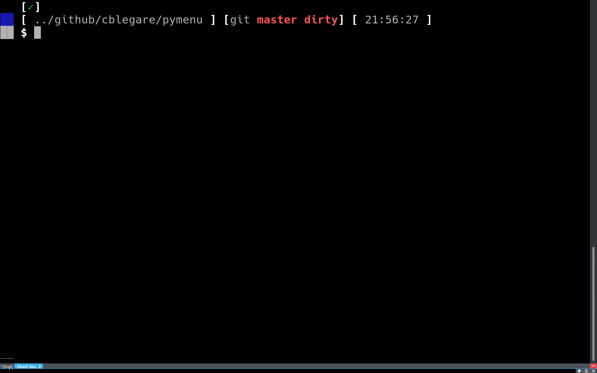

===========
Basic Usage
===========

A menu from with `pymenu` is made of two things:

The root menu entry
    Menu entries are trees where each branch is a submenu and each leaf is an
    item.

Prompt
    `pymenu` needs to know how to display the menu to the user.  This is what a
    **prompt** is used to.

A silly command line file manager
---------------------------------

Given the following directory structure:

.. code-block:: text

    .
    ├── demo.py
    ├── folder
    │   ├── deepfile
    │   └── subfolder
    │       └── deeperfile
    └── some_file

    2 directories, 4 files

Here is a simple script that makes a file manager for browsing folder and
printing the chosen file name.

.. literalinclude:: ../examples/silly_cli_file_manager/demo.py
    :language: python

You can see it in action in the following animated gif.

Leveraging `xdmenu`
-------------------

`pymenu` provides a simple API for building menus.  It leverages xdmenu_ (must
be installed) for delegating the display to an implementation of dmenu_.

Lets change the above silly example in order to browse our files using `dmenu`.

.. literalinclude:: ../examples/silly_dmenu_file_manager/demo.py
    :language: python
    :emphasize-lines: 4,7

Changes are emphasized. Simple enough, right?

Leveraging `XDG`
----------------

`pymenu` ships with an extension providing support for XDG_ menu definitons.
This can be useful when using a simple window manager that is not
XDG-compliant, such as Qtile_ and still wanting a XDG-based applications menu.

Here is a simple script for launching an application based on XDG menu
definitons.

.. literalinclude:: ../examples/xdg_application_dmenu/demo.py
    :language: python
    :emphasize-lines: 5,7,13

.. note:: `pymenu` has all you need for launching default applications as per
    the XDG specification.  Do not rely on this API, because it may (will) be
    moved to another package!

Performance Issues
------------------

`pymenu` do not implement lazy loading of menu entries.  This means that a menu
can use up a lot of RAM.  Also, Creating a menu may take some time, especially
when using XDG because of all the heavy XML files that needs parsing in the
process.

Please help!  See :ref:`Contributing <contributing>` for more informations.

.. _xdmenu: https://github.com/cblegare/xdmenu
.. _dmenu: http://tools.suckless.org/dmenu
.. _XDG: https://www.freedesktop.org/wiki/
.. _Qtile: http://www.qtile.org
